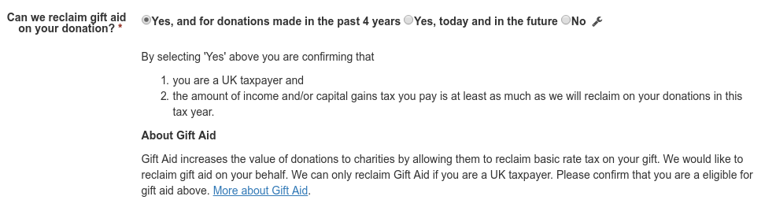

# The Gift Aid Declaration

On install, a "Gift Aid" profile was created for you.
If you add this to a contribution page the user can make the gift aid declaration:

It will then appear on the contact record:

## Declaration status
* Yes, and for donations made in the past 4 years.
* Yes, today and in the future.
* No.

To maintain a full audit trail every time the user changes the declaration status it will be closed:
* End date set to "now".
* Reason ended: Contact declined.

The *current* declaration represents the current status and will not have an end date set. This applies even if the
declaration is "No" - because it will represent a time period between start_date/end_date where the contact was not eligible.
